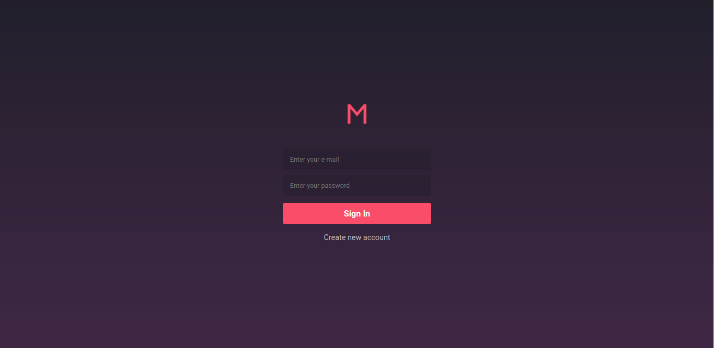

# Meetapp Web

The Meetapp application was build with ReactJS by using the API developed in this repository (<a href="https://github.com/saaddalida/meetapp-backend" target="_blank" rel="noopener noreferrer">Meetup Backend</a>).

This application will be used by meetup organizers and will not have meetup subscription features.

## Screens



This application have seven screens: Authentication, SignUp, Dashboard, Details, Create/Edit meetup and Profile.

### Running application

To clone and run this application, you'll need [Git](https://git-scm.com), [Node.js v10.16][nodejs] or higher + [Yarn v1.13][yarn] or higher installed on your computer and the [MeetApp API](https://github.com/saaddalida/meetapp-backend). From your command line:

    # Clone this repository
    $ git clone https://github.com/saaddalida/meetapp-frontend.git

    # Go into the repository
    $ cd meetapp-frontend

    # Install dependencies
    $ yarn install

    # Run the app
    $ yarn start

## Built With

- [ReactJS](https://reactjs.org/)
- [Redux](https://redux.js.org/)
- [Redux-Saga](https://github.com/redux-saga/redux-saga)
- [styled-components](https://www.styled-components.com/)
- [react-icons](https://react-icons.netlify.com/)
- [Axios](https://github.com/axios/axios)
- [Immer](https://github.com/immerjs/immer)
- [Polished](https://polished.js.org/)
- [react-toastify](https://fkhadra.github.io/react-toastify/)
- [date-fns](https://date-fns.org/)
- [Reactotron](https://infinite.red/reactotron)
- [VSCode](https://code.visualstudio.com/)

## Authors

- **Dalida Saad** - :wave: [Get in touch!](https://www.linkedin.com/in/dalida-saad/)

## License

This project is licensed under the MIT License.
```
